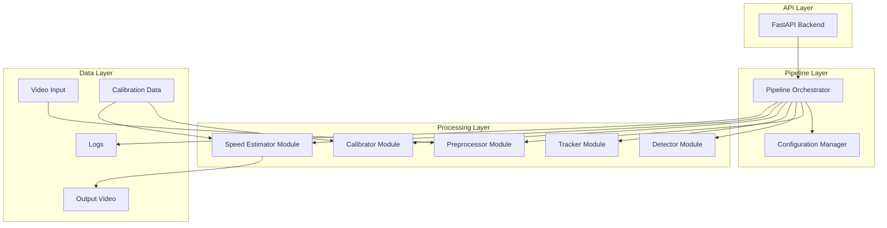

# Design Document: OpenCV Video Processing Pipeline

## Overview

The OpenCV Video Processing Pipeline is a modular computer vision system that processes video streams through a series of classical CV techniques without relying on machine learning models. The system provides capabilities for video preprocessing, object detection using background subtraction and edge detection, multi-object tracking, camera calibration, and speed estimation.

The architecture follows a pipeline pattern where each component can operate independently or as part of a coordinated processing chain. A FastAPI backend provides REST endpoints for integration with web applications and external systems. The design emphasizes modularity, configurability, and performance, targeting real-time processing at 15+ FPS for 1920x1080 resolution video.

Key design principles:
- **Modularity**: Each component (preprocessor, detector, tracker, calibrator, speed estimator) is an independent module with well-defined interfaces
- **Classical CV Focus**: Uses OpenCV's traditional algorithms (background subtraction, Canny edges, contour detection) rather than deep learning
- **Performance**: Optimized for real-time processing with configurable quality/speed tradeoffs
- **Configurability**: JSON/YAML-based configuration for all pipeline parameters
- **Robustness**: Comprehensive error handling with graceful degradation when components fail

## Architecture

### System Architecture

The system follows a layered architecture with three primary layers:



### Component Architecture

Each processing component follows a consistent interface pattern:

1. **Input**: Receives data from previous stage or external source
2. **Configuration**: Loads parameters from configuration manager
3. **Processing**: Applies computer vision algorithms
4. **Output**: Returns structured results to next stage
5. **Logging**: Records metrics and errors

### Data Flow

The typical data flow through the pipeline:

1. **Video Input** → Raw video frames from file or stream
2. **Preprocessor** → Normalized, filtered, resized frames
3. **Detector** → Bounding boxes and contours of detected objects
4. **Tracker** → Object IDs, positions, and trajectory history
5. **Speed Estimator** → Velocity calculations in real-world units
6. **Output** → Annotated video and summary statistics

Components can be selectively enabled/disabled via configuration, allowing flexible pipeline configurations.

## Components and Interfaces

### 1. Preprocessor Module

**Purpose**: Normalize and enhance video frames for optimal processing by downstream components.

**Interface**:
```python
class Preprocessor:
    def __init__(self, config: PreprocessorConfig):
        """Initialize with configuration parameters"""
        
    def process(self, frame: np.ndarray) -> np.ndarray:
        """
        Process a single video frame
        
        Args:
            frame: Input video frame (BGR format)
            
        Returns:
            Processed frame (grayscale, filtered, resized, normalized)
        """
```

**Configuration Parameters**:
- `target_resolution`: Tuple (width, height) for output resolution
- `noise_reduction_method`: "gaussian" | "bilateral" | "median"
- `noise_reduction_kernel_size`: Kernel size for filtering
- `normalize_intensity`: Boolean flag for intensity normalization

**Processing Steps**:
1. Convert BGR to grayscale
2. Apply noise reduction filter (Gaussian, bilateral, or median)
3. Resize to target resolution using INTER_AREA interpolation
4. Normalize pixel values to [0, 1] range if enabled

**Performance Target**: < 50ms for 1920x1080 input

### 2. Detector Module

**Purpose**: Identify objects in video frames using classical computer vision techniques.

**Interface**:
```python
class DetectionResult:
    bounding_boxes: List[Tuple[int, int, int, int]]  # (x, y, w, h)
    contours: List[np.ndarray]
    areas: List[float]
    centroids: List[Tuple[float, float]]

class Detector:
    def __init__(self, config: DetectorConfig):
        """Initialize detector with background subtractor and parameters"""
        
    def detect(self, frame: np.ndarray) -> DetectionResult:
        """
        Detect objects in preprocessed frame
        
        Args:
            frame: Preprocessed grayscale frame
            
        Returns:
            Detection results with bounding boxes and contours
        """
```

**Configuration Parameters**:
- `background_subtraction_method`: "MOG2" | "KNN" | "GMG"
- `background_learning_rate`: Learning rate for background model (0.0-1.0)
- `edge_detection_enabled`: Boolean flag for Canny edge detection
- `canny_threshold1`: Lower threshold for Canny
- `canny_threshold2`: Upper threshold for Canny
- `min_contour_area`: Minimum area to filter small noise
- `max_contour_area`: Maximum area to filter large regions

**Processing Steps**:
1. Apply background subtraction to identify foreground mask
2. Optionally apply Canny edge detection
3. Find contours in the foreground mask
4. Filter contours by area thresholds
5. Compute bounding boxes and centroids for valid contours
6. Update background model with current frame

**Algorithms**:
- Background Subtraction: MOG2 (Mixture of Gaussians) by default
- Edge Detection: Canny algorithm
- Contour Detection: OpenCV findContours with RETR_EXTERNAL

### 3. Tracker Module

**Purpose**: Maintain object identity across frames and build trajectory history.

**Interface**:
```python
class TrackingResult:
    object_ids: List[int]
    positions: List[Tuple[float, float]]
    trajectories: Dict[int, List[Tuple[float, float]]]  # id -> history
    ages: Dict[int, int]  # frames since first detection

class Tracker:
    def __init__(self, config: TrackerConfig):
        """Initialize tracker with matching parameters"""
        
    def update(self, detections: DetectionResult) -> TrackingResult:
        """
        Update tracking with new detections
        
        Args:
            detections: Current frame detection results
            
        Returns:
            Tracking results with IDs and trajectories
        """
```

**Configuration Parameters**:
- `max_tracking_distance`: Maximum pixel distance for matching (default: 50)
- `max_disappeared_frames`: Frames before removing lost objects (default: 30)
- `trajectory_history_length`: Number of positions to store (default: 100)

**Tracking Algorithm**:
- **Centroid Tracking**: Matches detections to existing tracks using centroid distance
- **Assignment**: Uses nearest-neighbor matching with distance threshold
- **ID Management**: Assigns new IDs to unmatched detections, removes stale tracks

**Processing Steps**:
1. Compute centroids from current detections
2. Match centroids to existing tracked objects using Euclidean distance
3. Assign new IDs to unmatched detections
4. Update trajectory history for matched objects
5. Increment disappeared counter for unmatched tracks
6. Remove tracks that exceeded max_disappeared_frames

### 4. Calibrator Module

**Purpose**: Perform camera calibration for distortion correction and spatial measurements.

**Interface**:
```python
class CalibrationParameters:
    camera_matrix: np.ndarray  # 3x3 intrinsic matrix
    distortion_coefficients: np.ndarray  # Distortion coefficients
    homography_matrix: Optional[np.ndarray]  # For perspective transform
    pixels_per_meter: Optional[float]  # Spatial scale

class Calibrator:
    def __init__(self, config: CalibratorConfig):
        """Initialize calibrator"""
        
    def calibrate(self, images: List[np.ndarray], 
                  chessboard_size: Tuple[int, int]) -> CalibrationParameters:
        """
        Calibrate camera from chessboard images
        
        Args:
            images: List of calibration images
            chessboard_size: Inner corners (cols, rows)
            
        Returns:
            Calibration parameters
        """
        
    def undistort(self, frame: np.ndarray, 
                  params: CalibrationParameters) -> np.ndarray:
        """Apply distortion correction to frame"""
        
    def apply_perspective_transform(self, frame: np.ndarray,
                                   params: CalibrationParameters) -> np.ndarray:
        """Apply homography for top-down view"""
        
    def save_calibration(self, params: CalibrationParameters, 
                        filepath: str) -> None:
        """Save calibration to file"""
        
    def load_calibration(self, filepath: str) -> CalibrationParameters:
        """Load calibration from file"""
```

**Configuration Parameters**:
- `calibration_file_path`: Path to save/load calibration data
- `chessboard_size`: Tuple (cols, rows) of inner corners
- `square_size_mm`: Physical size of chessboard squares
- `perspective_transform_enabled`: Boolean for homography application

**Calibration Process**:
1. Detect chessboard corners in calibration images using `findChessboardCorners`
2. Refine corner locations with `cornerSubPix`
3. Compute camera matrix and distortion coefficients using `calibrateCamera`
4. Optionally compute homography matrix for perspective correction
5. Save parameters to JSON file

**File Format** (JSON):
```json
{
  "camera_matrix": [[fx, 0, cx], [0, fy, cy], [0, 0, 1]],
  "distortion_coefficients": [k1, k2, p1, p2, k3],
  "homography_matrix": [[h11, h12, h13], ...],
  "pixels_per_meter": 42.5
}
```

### 5. Speed Estimator Module

**Purpose**: Calculate object velocities in real-world units using tracking and calibration data.

**Interface**:
```python
class SpeedResult:
    object_id: int
    instantaneous_speed: float  # m/s or px/s
    average_speed: float  # m/s or px/s
    unit: str  # "m/s" or "px/s"
    calibrated: bool  # Whether real-world calibration is available

class SpeedEstimator:
    def __init__(self, config: SpeedEstimatorConfig):
        """Initialize speed estimator"""
        
    def estimate_speeds(self, tracking: TrackingResult,
                       calibration: Optional[CalibrationParameters],
                       fps: float) -> List[SpeedResult]:
        """
        Estimate speeds for all tracked objects
        
        Args:
            tracking: Current tracking results
            calibration: Optional calibration parameters
            fps: Video frame rate
            
        Returns:
            Speed estimates for each tracked object
        """
```

**Configuration Parameters**:
- `averaging_window_frames`: Number of frames for average speed (default: 10)
- `min_trajectory_length`: Minimum points needed for speed calculation (default: 2)
- `output_unit`: "m/s" | "km/h" | "mph" (when calibrated)

**Speed Calculation**:
1. **Pixel Displacement**: Compute distance between consecutive trajectory points
2. **Temporal Scaling**: Divide by time interval (1/fps) to get velocity
3. **Spatial Scaling**: If calibration available, convert pixels to meters using pixels_per_meter
4. **Instantaneous Speed**: Velocity between last two trajectory points
5. **Average Speed**: Mean velocity over averaging window

**Formulas**:
- Instantaneous: `v = sqrt((x2-x1)² + (y2-y1)²) * fps * scale`
- Average: `v_avg = mean(v_i for i in window)`
- Scale: `1/pixels_per_meter` if calibrated, else 1.0

### 6. Pipeline Orchestrator

**Purpose**: Coordinate execution of all components and manage data flow.

**Interface**:
```python
class PipelineResult:
    frame_number: int
    annotated_frame: np.ndarray
    detections: DetectionResult
    tracking: TrackingResult
    speeds: List[SpeedResult]
    processing_time_ms: float

class PipelineOrchestrator:
    def __init__(self, config: PipelineConfig):
        """Initialize all components from configuration"""
        
    def process_frame(self, frame: np.ndarray, 
                     frame_number: int) -> PipelineResult:
        """Process single frame through enabled components"""
        
    def process_video(self, video_path: str, 
                     output_path: Optional[str] = None) -> Dict:
        """Process entire video file and generate summary"""
```

**Orchestration Logic**:
1. Load configuration and initialize enabled components
2. For each frame:
   - Apply preprocessing
   - Run detection if enabled
   - Update tracking if enabled
   - Estimate speeds if enabled
   - Annotate frame with results
   - Log processing metrics
3. Handle component failures gracefully (log and continue)
4. Generate summary statistics

### 7. Configuration Manager

**Purpose**: Load, validate, and provide access to configuration parameters.

**Interface**:
```python
class ConfigurationManager:
    def __init__(self, config_path: str):
        """Load configuration from JSON/YAML file"""
        
    def get_preprocessor_config(self) -> PreprocessorConfig:
        """Get preprocessor configuration"""
        
    def get_detector_config(self) -> DetectorConfig:
        """Get detector configuration"""
        
    # Similar methods for other components...
    
    def validate(self) -> List[str]:
        """Validate configuration and return warnings"""
```

**Configuration File Structure** (YAML):
```yaml
pipeline:
  enabled_components:
    - preprocessor
    - detector
    - tracker
    - speed_estimator
  
preprocessor:
  target_resolution: [1280, 720]
  noise_reduction_method: "gaussian"
  noise_reduction_kernel_size: 5
  normalize_intensity: true

detector:
  background_subtraction_method: "MOG2"
  background_learning_rate: 0.01
  edge_detection_enabled: false
  min_contour_area: 500
  max_contour_area: 50000

tracker:
  max_tracking_distance: 50
  max_disappeared_frames: 30
  trajectory_history_length: 100

calibrator:
  calibration_file_path: "calibration.json"
  chessboard_size: [9, 6]
  square_size_mm: 25.0

speed_estimator:
  averaging_window_frames: 10
  min_trajectory_length: 2
  output_unit: "m/s"

logging:
  level: "INFO"
  file_path: "pipeline.log"
  log_to_file: true
```

### 8. FastAPI Backend

**Purpose**: Provide REST API for pipeline integration.

**Endpoints**:

```python
# Frame processing
POST /api/v1/process/frame
  - Body: {"image": "base64_encoded_image", "config": {...}}
  - Returns: PipelineResult as JSON

# Video processing
POST /api/v1/process/video
  - Body: multipart/form-data with video file
  - Returns: {"task_id": "uuid"} for async processing

GET /api/v1/process/video/{task_id}
  - Returns: Processing status and results

# Calibration
POST /api/v1/calibration/calibrate
  - Body: {"images": ["base64_1", ...], "chessboard_size": [9, 6]}
  - Returns: CalibrationParameters

GET /api/v1/calibration/status
  - Returns: Current calibration status

POST /api/v1/calibration/load
  - Body: {"filepath": "calibration.json"}
  - Returns: Loaded calibration parameters

# Configuration
GET /api/v1/config
  - Returns: Current pipeline configuration

PUT /api/v1/config
  - Body: New configuration object
  - Returns: Validation results
```

**Async Processing**:
- Video processing tasks exceeding 5 seconds return task_id
- Background worker processes video
- Client polls status endpoint for completion
- Results stored temporarily with task_id key

## Data Models

### Core Data Structures

**VideoFrame**:
```python
@dataclass
class VideoFrame:
    data: np.ndarray  # Frame pixel data
    frame_number: int
    timestamp: float  # Seconds from video start
    resolution: Tuple[int, int]  # (width, height)
```

**DetectionResult**:
```python
@dataclass
class DetectionResult:
    frame_number: int
    bounding_boxes: List[BoundingBox]
    contours: List[np.ndarray]
    foreground_mask: np.ndarray
    
@dataclass
class BoundingBox:
    x: int
    y: int
    width: int
    height: int
    area: float
    centroid: Tuple[float, float]
```

**TrackingResult**:
```python
@dataclass
class TrackingResult:
    frame_number: int
    tracked_objects: List[TrackedObject]
    
@dataclass
class TrackedObject:
    object_id: int
    position: Tuple[float, float]
    bounding_box: BoundingBox
    trajectory: List[Tuple[float, float]]  # Recent history
    age: int  # Frames since first detection
    disappeared_count: int  # Consecutive frames without detection
```

**CalibrationParameters**:
```python
@dataclass
class CalibrationParameters:
    camera_matrix: np.ndarray  # 3x3 intrinsic matrix
    distortion_coefficients: np.ndarray  # [k1, k2, p1, p2, k3]
    homography_matrix: Optional[np.ndarray]  # 3x3 for perspective
    pixels_per_meter: Optional[float]
    calibration_error: float  # RMS reprojection error
    calibration_date: str  # ISO format timestamp
```

**SpeedResult**:
```python
@dataclass
class SpeedResult:
    object_id: int
    instantaneous_speed: float
    average_speed: float
    displacement_vector: Tuple[float, float]
    unit: str  # "m/s", "km/h", "mph", or "px/s"
    calibrated: bool
    confidence: float  # Based on trajectory smoothness
```

**PipelineResult**:
```python
@dataclass
class PipelineResult:
    frame_number: int
    timestamp: float
    annotated_frame: np.ndarray
    detections: Optional[DetectionResult]
    tracking: Optional[TrackingResult]
    speeds: Optional[List[SpeedResult]]
    processing_time_ms: float
    component_times: Dict[str, float]  # Per-component timing
```

**PipelineSummary**:
```python
@dataclass
class PipelineSummary:
    total_frames: int
    processed_frames: int
    average_fps: float
    total_objects_detected: int
    unique_objects_tracked: int
    average_speed: Optional[float]
    max_speed: Optional[float]
    processing_errors: List[str]
    component_statistics: Dict[str, ComponentStats]
    
@dataclass
class ComponentStats:
    component_name: str
    average_time_ms: float
    max_time_ms: float
    error_count: int
```

### Configuration Data Models

**PipelineConfig**:
```python
@dataclass
class PipelineConfig:
    enabled_components: List[str]
    preprocessor: PreprocessorConfig
    detector: DetectorConfig
    tracker: TrackerConfig
    calibrator: CalibratorConfig
    speed_estimator: SpeedEstimatorConfig
    logging: LoggingConfig
    
@dataclass
class PreprocessorConfig:
    target_resolution: Tuple[int, int]
    noise_reduction_method: str
    noise_reduction_kernel_size: int
    normalize_intensity: bool
    
@dataclass
class DetectorConfig:
    background_subtraction_method: str
    background_learning_rate: float
    edge_detection_enabled: bool
    canny_threshold1: int
    canny_threshold2: int
    min_contour_area: float
    max_contour_area: float
    
@dataclass
class TrackerConfig:
    max_tracking_distance: float
    max_disappeared_frames: int
    trajectory_history_length: int
    
@dataclass
class CalibratorConfig:
    calibration_file_path: str
    chessboard_size: Tuple[int, int]
    square_size_mm: float
    perspective_transform_enabled: bool
    
@dataclass
class SpeedEstimatorConfig:
    averaging_window_frames: int
    min_trajectory_length: int
    output_unit: str
    
@dataclass
class LoggingConfig:
    level: str
    file_path: Optional[str]
    log_to_file: bool
```

### API Request/Response Models

**FrameProcessRequest**:
```python
class FrameProcessRequest(BaseModel):
    image: str  # Base64-encoded image
    config: Optional[Dict]  # Override default config
    include_annotated_frame: bool = True
```

**VideoProcessRequest**:
```python
class VideoProcessRequest(BaseModel):
    video_file: UploadFile
    output_path: Optional[str]
    config: Optional[Dict]
```

**CalibrationRequest**:
```python
class CalibrationRequest(BaseModel):
    images: List[str]  # Base64-encoded calibration images
    chessboard_size: Tuple[int, int]
    square_size_mm: float
```

### Database Schema (Optional)

For persistent storage of processing results:

```sql
-- Processing jobs table
CREATE TABLE processing_jobs (
    job_id UUID PRIMARY KEY,
    video_filename VARCHAR(255),
    status VARCHAR(50),
    created_at TIMESTAMP,
    completed_at TIMESTAMP,
    config JSON,
    summary JSON
);

-- Tracking results table
CREATE TABLE tracking_results (
    id SERIAL PRIMARY KEY,
    job_id UUID REFERENCES processing_jobs(job_id),
    frame_number INT,
    object_id INT,
    position_x FLOAT,
    position_y FLOAT,
    speed FLOAT,
    timestamp TIMESTAMP
);
```


## Correctness Properties

*A property is a characteristic or behavior that should hold true across all valid executions of a system-essentially, a formal statement about what the system should do. Properties serve as the bridge between human-readable specifications and machine-verifiable correctness guarantees.*

### Property 1: Grayscale Conversion

*For any* video frame provided to the Preprocessor, the output SHALL be a single-channel grayscale image.

**Validates: Requirements 1.1**

### Property 2: Resolution Transformation

*For any* video frame and target resolution configuration, the Preprocessor output dimensions SHALL match the configured target resolution.

**Validates: Requirements 1.3**

### Property 3: Intensity Normalization

*For any* video frame processed with normalization enabled, all output pixel values SHALL be in the range [0, 1].

**Validates: Requirements 1.4**

### Property 4: Contour Area Filtering

*For any* detection result, all returned contours SHALL have areas within the configured minimum and maximum area thresholds (inclusive).

**Validates: Requirements 2.4**

### Property 5: Detection Result Completeness

*For any* detection operation, the returned DetectionResult SHALL contain bounding boxes, contours, centroids, and areas for all detected objects.

**Validates: Requirements 2.5**

### Property 6: Background Model Updates

*For any* sequence of frames processed with background subtraction enabled, the foreground mask for frame N+1 SHALL differ from frame N when the background model is updated.

**Validates: Requirements 2.6**

### Property 7: Unique Object Identifiers

*For any* tracking session, all assigned object IDs SHALL be unique within that session (no two active objects share the same ID).

**Validates: Requirements 3.1**

### Property 8: ID Persistence Across Frames

*For any* tracked object that remains within max_tracking_distance of its previous position, the object SHALL maintain the same ID across consecutive frames.

**Validates: Requirements 3.2**

### Property 9: Trajectory History Length

*For any* tracked object, the trajectory history SHALL contain at least min(frames_tracked, trajectory_history_length) position entries.

**Validates: Requirements 3.4**

### Property 10: Tracking Result Completeness

*For any* tracking operation, the returned TrackingResult SHALL contain object IDs, current positions, and trajectory history for all tracked objects.

**Validates: Requirements 3.5**

### Property 11: Separate Identity Maintenance

*For any* pair of simultaneously detected objects with centroids separated by more than max_tracking_distance, the Tracker SHALL assign different object IDs.

**Validates: Requirements 3.6**

### Property 12: Chessboard Corner Detection

*For any* valid calibration image containing a chessboard pattern of the configured size, the Calibrator SHALL detect the expected number of corners.

**Validates: Requirements 4.1**

### Property 13: Calibration Parameter Computation

*For any* set of at least 10 valid calibration images, the Calibrator SHALL produce a 3x3 camera matrix and distortion coefficients of length 5.

**Validates: Requirements 4.2, 4.3**

### Property 14: Calibration Persistence Round Trip

*For any* computed calibration parameters, saving to file then loading from file SHALL produce equivalent calibration parameters (camera matrix and distortion coefficients within numerical precision).

**Validates: Requirements 4.4, 4.5**

### Property 15: Frame Undistortion Application

*For any* video frame and valid calibration parameters, applying undistortion SHALL produce an output frame with the same dimensions as the input.

**Validates: Requirements 4.6**

### Property 16: Velocity Calculation from Trajectory

*For any* tracked object with at least 2 trajectory points, the Speed_Estimator SHALL calculate instantaneous velocity from the displacement between the last two points divided by the time interval.

**Validates: Requirements 5.1, 5.3**

### Property 17: Calibrated Speed Scaling

*For any* speed calculation with available calibration parameters, the output speed SHALL be scaled by (1 / pixels_per_meter) and the unit SHALL be "m/s" (or configured real-world unit).

**Validates: Requirements 5.2, 5.5**

### Property 18: Average Speed Window

*For any* tracked object with sufficient trajectory history, the average speed SHALL be computed over the configured averaging_window_frames.

**Validates: Requirements 5.4**

### Property 19: Uncalibrated Speed Fallback

*For any* speed calculation without calibration parameters, the output unit SHALL be "px/s" and the calibrated flag SHALL be false.

**Validates: Requirements 5.6**

### Property 20: Configuration Round Trip

*For any* valid pipeline configuration, saving to file then loading from file SHALL produce an equivalent configuration object.

**Validates: Requirements 6.5**

### Property 21: Component Skipping

*For any* component disabled in configuration, the pipeline SHALL NOT invoke that component's processing method during frame processing.

**Validates: Requirements 6.6**

### Property 22: API JSON Response Format

*For any* successful API request, the response SHALL be valid JSON that can be parsed without errors.

**Validates: Requirements 7.3**

### Property 23: Sequential Frame Reading

*For any* video file, frames SHALL be read in sequential order with frame numbers monotonically increasing.

**Validates: Requirements 8.1**

### Property 24: Annotated Frame Content

*For any* processed frame with detections, the annotated output frame SHALL contain visual markers (bounding boxes or contours) for each detected object.

**Validates: Requirements 8.4**

### Property 25: Summary Report Completeness

*For any* completed video processing job, the summary report SHALL contain total frame count, detection count, unique object count, and processing statistics.

**Validates: Requirements 8.5**

## Error Handling

The system implements comprehensive error handling at multiple levels:

### Component-Level Error Handling

Each processing component implements try-catch blocks around critical operations:

**Preprocessor**:
- Invalid frame data: Log error, return None
- Unsupported resolution: Log warning, use closest supported resolution
- Filter operation failure: Log error, return unfiltered frame

**Detector**:
- Background subtractor initialization failure: Log error, disable background subtraction
- Contour detection failure: Log error, return empty DetectionResult
- Invalid threshold configuration: Log warning, use default thresholds

**Tracker**:
- Invalid detection input: Log error, maintain previous tracking state
- ID overflow (>10000 objects): Log warning, reset ID counter
- Trajectory memory overflow: Log warning, trim oldest trajectory entries

**Calibrator**:
- Chessboard corner detection failure: Log error, skip image
- Insufficient calibration images: Raise CalibrationError with descriptive message
- Invalid calibration file: Log error, return None
- Undistortion failure: Log error, return original frame

**Speed Estimator**:
- Insufficient trajectory points: Log warning, return None for that object
- Division by zero (zero time interval): Log error, return 0 speed
- Missing calibration: Log info, proceed with pixel-based speed

### Pipeline-Level Error Handling

The Pipeline Orchestrator implements graceful degradation:

1. **Component Failure Isolation**: If one component fails, log the error and continue with remaining components
2. **Partial Results**: Return partial PipelineResult with available data
3. **Error Accumulation**: Collect all errors in PipelineResult.errors list
4. **Retry Logic**: For transient failures (e.g., file I/O), retry up to 3 times with exponential backoff

### API-Level Error Handling

FastAPI endpoints implement standardized error responses:

```python
class ErrorResponse(BaseModel):
    error_code: str
    message: str
    details: Optional[Dict]
    timestamp: str

# HTTP Status Codes:
# 400 - Invalid request (bad parameters, invalid image format)
# 404 - Resource not found (video file, calibration file)
# 422 - Validation error (configuration validation failure)
# 500 - Internal server error (component crash, unexpected exception)
# 503 - Service unavailable (resource exhaustion, system overload)
```

**Error Handling Strategies**:
- Input validation using Pydantic models
- Request timeout handling (30 second default)
- Rate limiting for resource-intensive endpoints
- Async task cancellation for long-running jobs

### Resource Management

**Memory Management**:
- Monitor memory usage every 100 frames
- Log warning at 80% memory usage
- Trigger garbage collection at 85% memory usage
- Raise MemoryError at 95% memory usage

**File Handle Management**:
- Use context managers for all file operations
- Automatic cleanup of temporary files
- Video capture release in finally blocks

**Thread Safety**:
- Thread-local storage for component instances
- Mutex locks for shared state (background model, tracking state)
- Async-safe logging with queue handlers

### Logging Strategy

**Log Levels**:
- **DEBUG**: Frame-by-frame processing details, algorithm parameters
- **INFO**: Pipeline start/stop, component initialization, processing statistics
- **WARNING**: Configuration issues, performance degradation, resource warnings
- **ERROR**: Component failures, invalid input, processing errors
- **CRITICAL**: System-level failures, unrecoverable errors

**Log Format**:
```
[TIMESTAMP] [LEVEL] [COMPONENT] [FRAME_NUMBER] MESSAGE
2024-01-15 10:30:45.123 INFO Preprocessor Frame 42 Processed in 12.3ms
2024-01-15 10:30:45.145 ERROR Detector Frame 42 Background subtraction failed: Invalid frame
```

**Structured Logging**:
- JSON-formatted logs for machine parsing
- Include context: frame_number, object_id, component_name
- Performance metrics: processing_time_ms, memory_usage_mb

## Testing Strategy

The testing strategy employs a dual approach combining unit tests for specific scenarios and property-based tests for comprehensive coverage.

### Unit Testing

Unit tests focus on specific examples, edge cases, and integration points:

**Preprocessor Tests**:
- Test grayscale conversion with known RGB values
- Test noise reduction with synthetic noisy images
- Test edge cases: empty frames, single-pixel frames, maximum resolution frames
- Test configuration loading and validation

**Detector Tests**:
- Test background subtraction with static and moving objects
- Test contour filtering with known shapes
- Test edge cases: no objects, overlapping objects, objects at frame boundaries
- Test background model persistence across frames

**Tracker Tests**:
- Test ID assignment for new objects
- Test ID persistence for stationary objects
- Test object disappearance and removal after 30 frames (specific example)
- Test trajectory history management
- Test edge cases: objects entering/leaving frame, rapid movement

**Calibrator Tests**:
- Test calibration with standard chessboard images
- Test calibration file save/load with known parameters
- Test undistortion with known distortion patterns
- Test edge cases: insufficient images, invalid chessboard size, corrupted calibration file

**Speed Estimator Tests**:
- Test speed calculation with known trajectories
- Test unit conversion with known calibration parameters
- Test averaging over specific window sizes
- Test edge cases: single-point trajectory, zero displacement, missing calibration

**Pipeline Integration Tests**:
- Test full pipeline with sample video
- Test component chaining and data flow
- Test error propagation and graceful degradation
- Test configuration-based component enabling/disabling

**API Tests**:
- Test all endpoints with valid requests
- Test input format handling (base64, multipart)
- Test async task creation and retrieval
- Test error responses for invalid inputs

### Property-Based Testing

Property-based tests verify universal properties across randomized inputs using a PBT library (e.g., Hypothesis for Python):

**Configuration**: Each property test runs a minimum of 100 iterations with randomized inputs.

**Test Tagging**: Each property test includes a comment tag referencing the design document:
```python
# Feature: opencv-video-processing-pipeline, Property 1: Grayscale Conversion
@given(video_frame=strategies.video_frames())
def test_grayscale_conversion_property(video_frame):
    ...
```

**Property Test Suite**:

**Property 1: Grayscale Conversion**
```python
# Feature: opencv-video-processing-pipeline, Property 1: Grayscale Conversion
@given(frame=st.video_frames(min_width=100, max_width=1920, 
                              min_height=100, max_height=1080))
@settings(max_examples=100)
def test_grayscale_conversion(frame):
    preprocessor = Preprocessor(default_config)
    result = preprocessor.process(frame)
    assert result.ndim == 2  # Single channel
    assert result.dtype == np.uint8 or result.dtype == np.float32
```

**Property 2: Resolution Transformation**
```python
# Feature: opencv-video-processing-pipeline, Property 2: Resolution Transformation
@given(frame=st.video_frames(), 
       target_res=st.tuples(st.integers(64, 1920), st.integers(64, 1080)))
@settings(max_examples=100)
def test_resolution_transformation(frame, target_res):
    config = PreprocessorConfig(target_resolution=target_res)
    preprocessor = Preprocessor(config)
    result = preprocessor.process(frame)
    assert result.shape == (target_res[1], target_res[0])
```

**Property 3: Intensity Normalization**
```python
# Feature: opencv-video-processing-pipeline, Property 3: Intensity Normalization
@given(frame=st.video_frames())
@settings(max_examples=100)
def test_intensity_normalization(frame):
    config = PreprocessorConfig(normalize_intensity=True)
    preprocessor = Preprocessor(config)
    result = preprocessor.process(frame)
    assert np.all(result >= 0.0) and np.all(result <= 1.0)
```

**Property 4: Contour Area Filtering**
```python
# Feature: opencv-video-processing-pipeline, Property 4: Contour Area Filtering
@given(frame=st.video_frames(),
       min_area=st.floats(100, 1000),
       max_area=st.floats(10000, 50000))
@settings(max_examples=100)
def test_contour_area_filtering(frame, min_area, max_area):
    assume(min_area < max_area)
    config = DetectorConfig(min_contour_area=min_area, max_contour_area=max_area)
    detector = Detector(config)
    result = detector.detect(frame)
    for area in result.areas:
        assert min_area <= area <= max_area
```

**Property 5: Detection Result Completeness**
```python
# Feature: opencv-video-processing-pipeline, Property 5: Detection Result Completeness
@given(frame=st.video_frames())
@settings(max_examples=100)
def test_detection_result_completeness(frame):
    detector = Detector(default_config)
    result = detector.detect(frame)
    n = len(result.bounding_boxes)
    assert len(result.contours) == n
    assert len(result.areas) == n
    assert len(result.centroids) == n
```

**Property 7: Unique Object Identifiers**
```python
# Feature: opencv-video-processing-pipeline, Property 7: Unique Object Identifiers
@given(detections=st.lists(st.detection_results(), min_size=1, max_size=50))
@settings(max_examples=100)
def test_unique_object_ids(detections):
    tracker = Tracker(default_config)
    all_ids = []
    for detection in detections:
        result = tracker.update(detection)
        all_ids.extend(result.object_ids)
    # At any single frame, all IDs should be unique
    for detection in detections:
        result = tracker.update(detection)
        assert len(result.object_ids) == len(set(result.object_ids))
```

**Property 8: ID Persistence Across Frames**
```python
# Feature: opencv-video-processing-pipeline, Property 8: ID Persistence Across Frames
@given(initial_pos=st.tuples(st.floats(0, 1000), st.floats(0, 1000)),
       displacement=st.floats(0, 30))  # Within max_tracking_distance
@settings(max_examples=100)
def test_id_persistence(initial_pos, displacement):
    tracker = Tracker(TrackerConfig(max_tracking_distance=50))
    
    # First detection
    det1 = create_detection_at(initial_pos)
    result1 = tracker.update(det1)
    obj_id = result1.object_ids[0]
    
    # Second detection nearby
    new_pos = (initial_pos[0] + displacement, initial_pos[1])
    det2 = create_detection_at(new_pos)
    result2 = tracker.update(det2)
    
    assert obj_id in result2.object_ids
```

**Property 9: Trajectory History Length**
```python
# Feature: opencv-video-processing-pipeline, Property 9: Trajectory History Length
@given(num_frames=st.integers(1, 200))
@settings(max_examples=100)
def test_trajectory_history_length(num_frames):
    config = TrackerConfig(trajectory_history_length=100)
    tracker = Tracker(config)
    
    for i in range(num_frames):
        detection = create_detection_at((100 + i, 100))
        result = tracker.update(detection)
    
    for obj_id, trajectory in result.trajectories.items():
        expected_length = min(num_frames, 100)
        assert len(trajectory) >= expected_length
```

**Property 14: Calibration Persistence Round Trip**
```python
# Feature: opencv-video-processing-pipeline, Property 14: Calibration Persistence Round Trip
@given(images=st.lists(st.chessboard_images(), min_size=10, max_size=20))
@settings(max_examples=100)
def test_calibration_round_trip(images, tmp_path):
    calibrator = Calibrator(default_config)
    
    # Calibrate
    params1 = calibrator.calibrate(images, chessboard_size=(9, 6))
    
    # Save and load
    filepath = tmp_path / "calibration.json"
    calibrator.save_calibration(params1, str(filepath))
    params2 = calibrator.load_calibration(str(filepath))
    
    # Verify equivalence
    assert np.allclose(params1.camera_matrix, params2.camera_matrix, rtol=1e-5)
    assert np.allclose(params1.distortion_coefficients, 
                      params2.distortion_coefficients, rtol=1e-5)
```

**Property 16: Velocity Calculation from Trajectory**
```python
# Feature: opencv-video-processing-pipeline, Property 16: Velocity Calculation from Trajectory
@given(pos1=st.tuples(st.floats(0, 1000), st.floats(0, 1000)),
       pos2=st.tuples(st.floats(0, 1000), st.floats(0, 1000)),
       fps=st.floats(15, 60))
@settings(max_examples=100)
def test_velocity_calculation(pos1, pos2, fps):
    tracking = create_tracking_result_with_trajectory([pos1, pos2])
    estimator = SpeedEstimator(default_config)
    
    results = estimator.estimate_speeds(tracking, calibration=None, fps=fps)
    
    expected_displacement = np.sqrt((pos2[0]-pos1[0])**2 + (pos2[1]-pos1[1])**2)
    expected_speed = expected_displacement * fps
    
    assert np.isclose(results[0].instantaneous_speed, expected_speed, rtol=0.01)
```

**Property 17: Calibrated Speed Scaling**
```python
# Feature: opencv-video-processing-pipeline, Property 17: Calibrated Speed Scaling
@given(trajectory=st.trajectories(min_length=2),
       pixels_per_meter=st.floats(10, 100),
       fps=st.floats(15, 60))
@settings(max_examples=100)
def test_calibrated_speed_scaling(trajectory, pixels_per_meter, fps):
    tracking = create_tracking_result_with_trajectory(trajectory)
    calibration = CalibrationParameters(
        camera_matrix=np.eye(3),
        distortion_coefficients=np.zeros(5),
        pixels_per_meter=pixels_per_meter
    )
    estimator = SpeedEstimator(SpeedEstimatorConfig(output_unit="m/s"))
    
    results = estimator.estimate_speeds(tracking, calibration, fps)
    
    assert results[0].unit == "m/s"
    assert results[0].calibrated == True
    # Speed should be scaled by 1/pixels_per_meter
```

**Property 19: Uncalibrated Speed Fallback**
```python
# Feature: opencv-video-processing-pipeline, Property 19: Uncalibrated Speed Fallback
@given(trajectory=st.trajectories(min_length=2), fps=st.floats(15, 60))
@settings(max_examples=100)
def test_uncalibrated_speed_fallback(trajectory, fps):
    tracking = create_tracking_result_with_trajectory(trajectory)
    estimator = SpeedEstimator(default_config)
    
    results = estimator.estimate_speeds(tracking, calibration=None, fps=fps)
    
    assert results[0].unit == "px/s"
    assert results[0].calibrated == False
```

**Property 20: Configuration Round Trip**
```python
# Feature: opencv-video-processing-pipeline, Property 20: Configuration Round Trip
@given(config=st.pipeline_configs())
@settings(max_examples=100)
def test_configuration_round_trip(config, tmp_path):
    filepath = tmp_path / "config.yaml"
    
    # Save
    config_manager = ConfigurationManager.from_config(config)
    config_manager.save(str(filepath))
    
    # Load
    loaded_manager = ConfigurationManager(str(filepath))
    loaded_config = loaded_manager.get_pipeline_config()
    
    # Verify equivalence
    assert config == loaded_config
```

**Property 22: API JSON Response Format**
```python
# Feature: opencv-video-processing-pipeline, Property 22: API JSON Response Format
@given(frame=st.video_frames())
@settings(max_examples=100)
def test_api_json_response(frame, test_client):
    import json
    
    # Encode frame as base64
    encoded = base64.b64encode(cv2.imencode('.jpg', frame)[1]).decode()
    
    response = test_client.post("/api/v1/process/frame", 
                                json={"image": encoded})
    
    assert response.status_code == 200
    # Should be valid JSON
    data = json.loads(response.content)
    assert isinstance(data, dict)
```

**Property 23: Sequential Frame Reading**
```python
# Feature: opencv-video-processing-pipeline, Property 23: Sequential Frame Reading
@given(video=st.video_files(min_frames=10, max_frames=100))
@settings(max_examples=100)
def test_sequential_frame_reading(video):
    pipeline = PipelineOrchestrator(default_config)
    
    frame_numbers = []
    for result in pipeline.process_video(video):
        frame_numbers.append(result.frame_number)
    
    # Frame numbers should be monotonically increasing
    assert frame_numbers == sorted(frame_numbers)
    assert frame_numbers == list(range(len(frame_numbers)))
```

**Property 25: Summary Report Completeness**
```python
# Feature: opencv-video-processing-pipeline, Property 25: Summary Report Completeness
@given(video=st.video_files(min_frames=5, max_frames=50))
@settings(max_examples=100)
def test_summary_report_completeness(video):
    pipeline = PipelineOrchestrator(default_config)
    summary = pipeline.process_video(video)
    
    assert hasattr(summary, 'total_frames')
    assert hasattr(summary, 'total_objects_detected')
    assert hasattr(summary, 'unique_objects_tracked')
    assert hasattr(summary, 'average_fps')
    assert hasattr(summary, 'component_statistics')
    assert summary.total_frames > 0
```

### Custom Hypothesis Strategies

To support property-based testing, custom strategies generate domain-specific test data:

```python
import hypothesis.strategies as st
import numpy as np

@st.composite
def video_frames(draw, min_width=64, max_width=1920, 
                min_height=64, max_height=1080):
    """Generate random video frames"""
    width = draw(st.integers(min_width, max_width))
    height = draw(st.integers(min_height, max_height))
    frame = np.random.randint(0, 256, (height, width, 3), dtype=np.uint8)
    return frame

@st.composite
def detection_results(draw):
    """Generate random detection results"""
    num_objects = draw(st.integers(0, 20))
    bboxes = [draw(st.tuples(st.integers(0, 1000), st.integers(0, 1000),
                             st.integers(10, 200), st.integers(10, 200)))
              for _ in range(num_objects)]
    # Generate corresponding contours, areas, centroids...
    return DetectionResult(...)

@st.composite
def trajectories(draw, min_length=2, max_length=100):
    """Generate random object trajectories"""
    length = draw(st.integers(min_length, max_length))
    points = [(draw(st.floats(0, 1000)), draw(st.floats(0, 1000))) 
              for _ in range(length)]
    return points

@st.composite
def chessboard_images(draw):
    """Generate synthetic chessboard calibration images"""
    # Generate chessboard pattern with random perspective and lighting
    ...
    return image

@st.composite
def pipeline_configs(draw):
    """Generate random valid pipeline configurations"""
    return PipelineConfig(
        enabled_components=draw(st.lists(st.sampled_from(
            ['preprocessor', 'detector', 'tracker', 'speed_estimator']),
            min_size=1, unique=True)),
        preprocessor=draw(preprocessor_configs()),
        detector=draw(detector_configs()),
        # ...
    )
```

### Test Coverage Goals

- **Line Coverage**: Minimum 85% for all modules
- **Branch Coverage**: Minimum 80% for conditional logic
- **Property Coverage**: 100% of correctness properties implemented as tests
- **Integration Coverage**: All component interfaces tested
- **API Coverage**: All endpoints tested with valid and invalid inputs

### Continuous Integration

Tests run automatically on:
- Every commit (unit tests + fast property tests with 10 iterations)
- Pull requests (full test suite with 100 iterations per property)
- Nightly builds (extended property tests with 1000 iterations)

Performance benchmarks run weekly to detect regressions.
